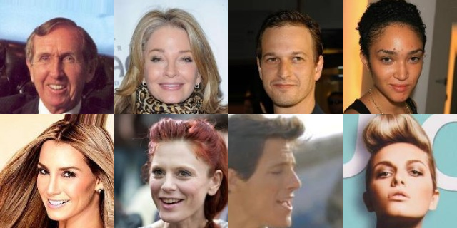
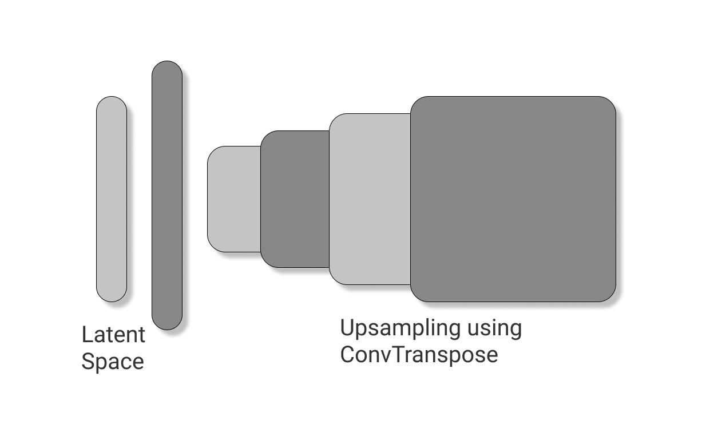
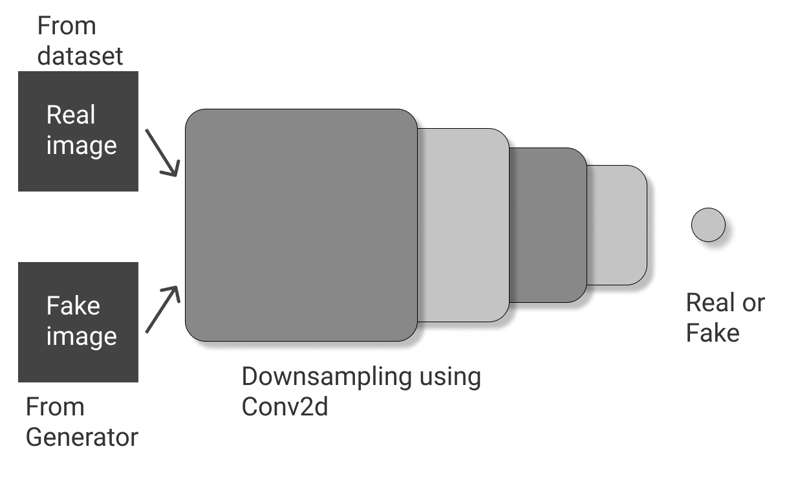

# Deep-Generative-Modelling
Generative models using Deep convolutional Networks.

## Data collection and pre-processing 
- [CelebA dataset](https://www.kaggle.com/jessicali9530/celeba-dataset) by Jessica Li and team.
- Cropped to square and resized to (160, 160, 3). (Gray scale images can also be used if computation is expensive).
- Stored in a [zip file](https://drive.google.com/file/d/1-1tWqqRMIEh7-brHL2zYaiRUcrLN8Ixk/view?usp=sharing) without compromizing the file names.
- Refer [preprocess_images.ipynb](./preprocess_images.ipynb) for more details. 
#### Here is a collage of preprocessed images

### The model architecture
- An up-sampling convolutional network for the Generator.
- A down-sampling convolutional network for the Discriminator.

#### Generator architecture

#### Discriminator architecture

